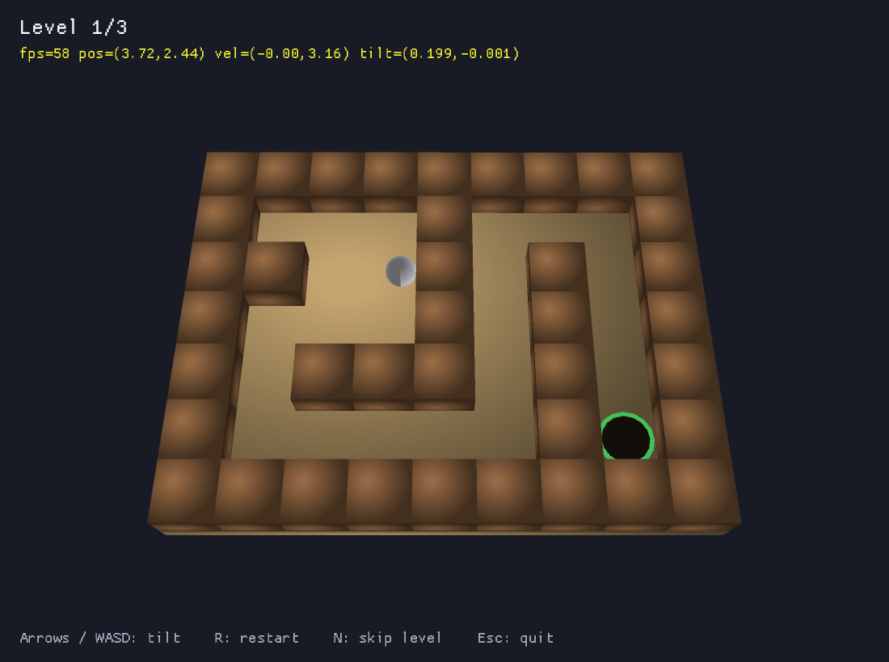

# Tilt Maze

A 3D labyrinth game written in Rust. Tilt the board to roll the ball through the maze and drop it into the green goal hole — without falling into the red trap holes.



## How to play

| Key | Action |
|---|---|
| Arrow keys / WASD | Tilt the board |
| R | Restart level (or restart the game after winning) |
| N | Skip to the next level |
| Esc | Quit |

Three levels. Later levels add trap holes — falling in sends you back to the start.

## Running

Grab `tilt-maze.exe` from the [releases page](../../releases) if available, or build from source:

```sh
# install Rust first: https://rustup.rs
cargo run --release
```

The compiled binary lands in `target/release/tilt-maze.exe`.

## Extras

- `tilt-maze --bot` — an autopilot plays the game: BFS pathfinding over the maze grid, steering the tilt while avoiding traps. Useful for testing that new levels are beatable. It records the whole run into a single `gameplay.gif` and exits after winning.
- `tilt-maze --auto` — a short scripted stress-run that dumps `auto_*.png` framebuffer captures, used for visual regression testing.

## Adding levels

Levels are ASCII maps in `LEVELS` at the top of [src/main.rs](src/main.rs):

```text
#  wall        S  ball start
.  floor       G  goal hole
O  trap hole
```

Any rectangular, fully-bordered map works. Run `--bot` to verify it's solvable.

## Tech notes

- Built with [macroquad](https://github.com/not-fl3/macroquad) (MIT / Apache-2.0) — the only dependency.
- Physics are hand-rolled: the ball is simulated in 2D board space (tilt-projected gravity, circle-vs-grid collisions with substepping and a tunneling watchdog), and the scene is rendered in 3D by rotating the whole board with a model matrix.
- The board and walls are pre-built into a single mesh per level (hidden faces culled, directional shading baked into vertex colors), so a frame is only a handful of draw calls.
- macroquad has no lighting; the soft shading comes from a procedurally generated highlight texture plus the baked vertex colors.
